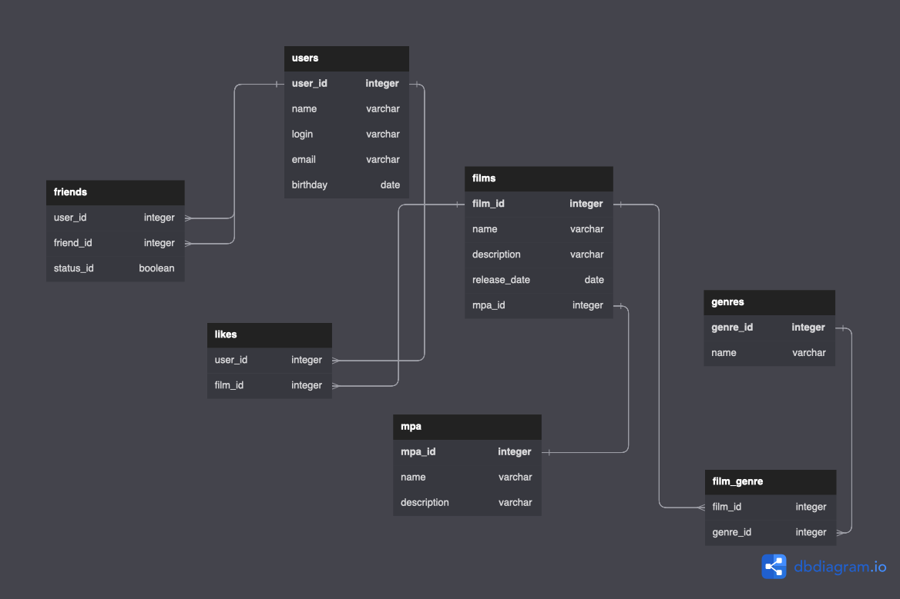

# java-filmorate
Template repository for Filmorate project.

*при выполнении тз 11 изменил диаграмму т.к нашел ошибки
### диаграмма базы данных

### Комментарий от проверяющего промежуточное тз:
#### Привет, на мой взгляд все логично. Вполне рабочий вариант. Успехов в работе

https://github.com/nikitatuseev/java-filmorate/pull/4

## Примеры запросов:

### 1.список всех пользователей

SELECT *

FROM users

### 2.список всех фильмов

SELECT *

FROM films

### 3.пользователь с конкретным id(например id=2)

SELECT *

FROM users

WHERE user_id=2

### 4.фильм с конкретным id(например id=3)

SELECT *

FROM films

WHERE film_id=3

### 5.получить информацию о пользователях и их друзьях

SELECT u.name AS user_name, f.name AS friend_name

FROM users u

JOIN friends f ON u.user_id = f.user_id;

### 6.получить список всех жанров и количество фильмов в каждом жанре

SELECT g.title AS genre, COUNT(f.film_id) AS movie_count

FROM genres g

JOIN films f ON g.genre_id = f.genre_id

GROUP BY g.genre_id;
