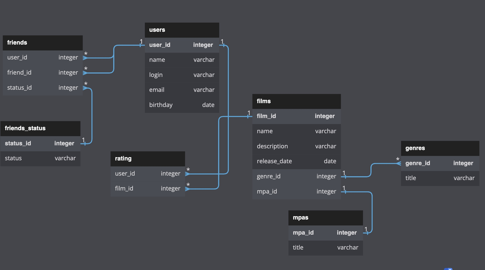

# java-filmorate
Template repository for Filmorate project.

### диаграмма базы данных

## Примеры запросов:

### 1.список всех пользователей

SELECT *

FROM users

### 2.список всех фильмов

SELECT *

FROM films

### 3.пользователь с конкретным id(например id=2)

SELECT *

FROM users

WHERE user_id=2

### 4.фильм с конкретным id(например id=3)

SELECT *

FROM films

WHERE film_id=3

### 5.получить информацию о пользователях и их друзьях

SELECT u.name AS user_name, f.name AS friend_name

FROM users u

JOIN friends f ON u.user_id = f.user_id;

### 6.получить список всех жанров и количество фильмов в каждом жанре

SELECT g.title AS genre, COUNT(f.film_id) AS movie_count

FROM genres g

JOIN films f ON g.genre_id = f.genre_id

GROUP BY g.genre_id;

### 7.найти всех пользователей, которые имеют друзей и их текущий статус

SELECT u.name AS user_name, fs.status

FROM users u

JOIN friends f ON u.user_id = f.user_id

JOIN friends_status fs ON f.status_id = fs.status_id;

### 8.список общих друзей двух пользователей

SELECT u.name AS user_name

FROM users u

JOIN friends f1 ON u.user_id = f1.user_id

JOIN friends f2 ON f1.friend_id = f2.friend_id

WHERE f1.user_id = {user1_id} 

AND f2.user_id = {user2_id}; 

//user1_id и user2_id это id пользователей например 1 и 2